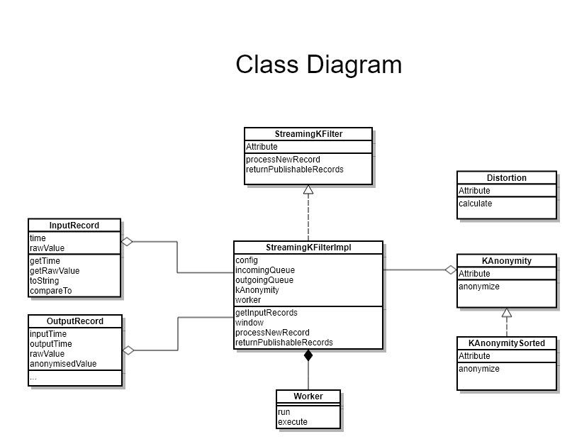

"# streaming-anonymous-algorithm" 

# streaming-anonymous-algorithm
This a dummy platform to implement a streaming anonymous algorithm to protect InputRecord.


## Requirements

### Step 1
1. Application Structure

     
     
     
     
2. K-anonymisation Algorithm (1 hour)
    
    1.1 sorted and fix-size aggregation algorithm
    * sort records by rawValue.    
    * split all records into diff group, make sure that there are K records in each group
    * If the number of records is not a multiple of K, those records aggregate into the last group.
    
    
    
    
3. Stream Windows Strategy
    
    In this version, window's size fixed in the config file.
    
    Next step, dynamic calculation of the size of the window
    
    2.1 [Kafka Stream Windows]
    
    2.2 [Stream Windows in Apache Flink]
    


### Step 2 
#### Distortion
1. calculate the mean of the InputRecord's rawValue
2. calculate Mean Variances as A
3. calculate Anonymised Mean Variances as B
4. Distortion = B / A

[Distortion Algorithm Java File](src/main/java/com/zilong/filter/Distortion.java)

### Step 3
#### explore the trade-offs between latency and information loss.  

 
 
 

[Analysis tool Java File](src/main/test/com/zilong/filter/TradeOffsLatencyAndLossTest.java)

## Documents 
1. What is [K-anonymity]


## Quickstart
### What you’ll need
1. JDK 1.8 or later 
2. Maven 3.2+

### Run the application
If you are using Maven, execute:
```
 mvn package spring-boot:run
```
Then Open [Test Page]
```
 http://localhost:8080
```


[Test Page]: http://localhost:8080
[Kafka Stream Windows]: http://kafka.apache.org/10/documentation/streams/developer-guide/dsl-api.html#windowing
[Stream Windows in Apache Flink]: https://flink.apache.org/news/2015/12/04/Introducing-windowGenerator.html
